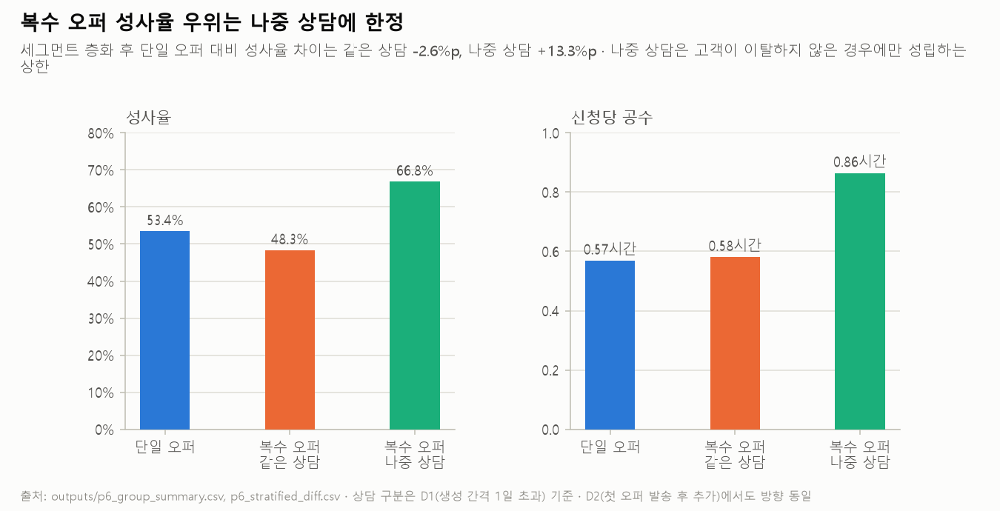
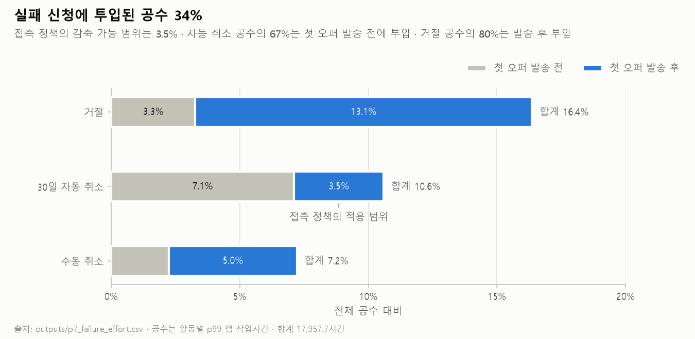

> 한국어 · [English](README.md)

# 대출 오퍼 타겟팅 분석 — 성사율과 효율의 불일치

**성사율이 높은 신청과 실제로 이익이 되는 신청은 같은가.** 네덜란드 금융기관의 대출 신청 처리 로그(BPI Challenge 2017, 신청 31,509건·이벤트 120만 건)로 이 질문을 검증했으며 결론은 **"같지 않다"**입니다. 확인된 차이는 자원 배분 규칙과 시스템 요구사항으로 연결했습니다.

## 핵심 결론

- **성사율 순위와 공수 대비 효율 순위의 상관은 0.669**입니다. 세그먼트 39개는 접수 시점에 확인 가능한 정보만으로 구성했으며 부트스트랩 90% 구간 0.610\~0.692는 사전에 고정한 판정 경계 0.7 아래에 있습니다.
- 같은 공수를 효율 순서로 배분하면 공수 예산 50% 지점에서 **확보 대출 규모가 13.2% 증가**합니다.
- 성사율 상위에는 소액·중액 신청이 분포하며 효율 상위는 대형 신규 신청입니다. 성사율과 대출 규모의 순위 상관이 0.454에 불과하므로, 성사율만으로 판단하면 규모의 차이를 반영하지 못합니다.


## 1. 배경과 위치 선정

분석 대상은 네덜란드 금융기관의 2016년 대출 신청 처리 로그입니다. 이벤트 1,202,267건, 신청 31,509건, 활동 26종이 기록되어 있으며, 4TU.ResearchData가 공개한 BPI Challenge 2017 데이터입니다.

은행이 챌린지에서 공식적으로 제기한 질문은 세 가지입니다. 처리 구간별 소요시간, 보완 요청 빈도가 결과에 미치는 영향, 단일 오퍼와 복수 오퍼의 전환율 비교입니다. 세 질문 모두 시간과 전환율에서 멈추며, 투입 공수 대비 가치는 다루지 않습니다. **은행은 전환율을 물었고, 이 프로젝트는 경제성을 묻습니다.**

이 저장소는 두 선행 작업과 연결됩니다.

| 선행 작업 | 관점 | 질문 | 이 프로젝트와의 관계 |
|---|---|---|---|
| [sap-btm-financial-prospecting](https://github.com/eugeejo-ui/sap-btm-financial-prospecting) | 벤더(프리세일즈) | 시간이 어디서 사라지는가 | 같은 BPI 2017 로그로 문제의 존재를 증명했습니다. 이 프로젝트는 그 공수를 누구에게 배분할 것인가를 판단합니다 |
| 구독 전환 대상 재정의 (B2C 스트리밍) | 사업 운영 | 전환시킬 대상을 어떻게 다시 잡는가 | 기대값으로 타겟을 재산정하는 계산 구조를 이 프로젝트에 이식했습니다. 선행 결론은 "많이 사는 사람이 아니라 적게 사는 사람"이었고 이 프로젝트에서는 "성사율이 높은 신청이 아니라 규모가 큰 신청"입니다 |

## 2. 분석 범위와 지표 정의

**모집단.** 접수월 완료율이 99% 이상인 구간까지만 포함해 관측창을 확보했으며 2016년 1\~11월에 접수되고 결과가 확정된 신청 29,131건이 분석 대상입니다. 성공은 오퍼 수락 단계(A_Pending) 도달로 정의했고, 이 정의로 선행 문헌의 수치를 재현했습니다(단일 오퍼 53.06%, 복수 오퍼 59.00%).

**공수.** 직원이 실제로 작업한 시간만 합산했습니다. 고객 회신 대기 구간은 제외했고 방치된 구간에는 활동별 상위 1% 값을 상한으로 적용했습니다. 모집단 전체 공수는 17,957.7시간입니다.

**지표.** 효율 η = R̄ × p ÷ Ē로 정의했습니다. R̄는 성사 신청이 수락한 오퍼 금액의 평균, p는 성사율, Ē는 세그먼트 전체 신청의 평균 공수입니다. 마진율과 공수 단가는 로그에 없으므로 두 미지수를 비율 하나(공수 단가 ÷ 마진율)로 축약했습니다. 기대값이 음수가 되는 조건은 이 비율이 η를 초과하는 경우이며 세그먼트 순위는 두 미지수의 선택과 무관하게 확정됩니다.

**세그먼트.** 신청 금액 등급, 접수 경로, 대출 용도 세 축을 교차해 44개를 구성했습니다. 세 축은 모두 접수 시점에 확인 가능한 정보이며 300건 이상인 39개(28,243건)로 순위를 산정했습니다. 세 축 모두 효율의 차이를 형성합니다(최고 대 최저 5.84배·2.21배·1.50배).

## 3. 가설과 판정 규칙

반전 시나리오 세 가지와 판정 경계는 착수 전에 고정했습니다. 수치 확인 이후에 기준을 변경하지 않기 위한 조치입니다.

| 가설 | 판정 | 근거 |
|---|---|---|
| 복수 오퍼는 소액 구간에서 효율이 역전된다 | **기각** | 소액 구간의 추가 오퍼 증분 효율(6,704)이 그 구간 평균(4,974)보다 높습니다 |
| 금액이 클수록 공수가 비선형으로 증가한다 | **기각** | 금액 등급이 상승할 때 공수는 1.38배 증가하고 대출 규모는 약 6배 증가합니다 |
| 실패한 신청이 공수의 상당 부분을 소진한다 | **규모는 확인, 회수 가능성은 기각** | 실패 공수는 34.2%지만 개입 수단으로 회수 가능한 비중은 3.5%입니다 |

핵심 질문의 판정 경계도 같은 방식으로 고정했으며 성사율 순위와 효율 순위의 상관이 0.9 이상이면 "같다", 0.7\~0.9면 "대체로 같되 어긋남 존재", 0.7 미만이면 "다르다"입니다.

## 4. 검증 과정

분석은 11단계로 구성했고 단계마다 진행계획과 판정 규칙을 사전에 고정한 뒤 실행했습니다. 각 단계의 결론 문서는 [`docs/`](docs/)에, 진행계획과 실행 기록은 [`docs/plans/`](docs/plans/)에 있습니다.

| 단계 | 확인한 것 | 결과 |
|---|---|---|
| [0 데이터 범위](docs/00_scope.md) | 모집단·성공 정의·속성 품질 | 29,131건 확정. 신용점수 등 3개 속성은 결과가 사후 반영된 값이라 사용 금지로 분류 |
| [1 프로세스 현황](docs/01_process_baseline.md) | 이탈 위치와 경과시간의 보유 주체 | 취소 9,692건 중 8,630건이 오퍼 발송 후 고객 회신 전에 정지. 경과시간의 82.2%를 고객이 보유 |
| [2 공수 측정](docs/02_effort.md) | 케이스별 작업시간 | 상위 1% 구간이 시간의 28.5%를 차지해 활동별 캡 적용. 캡 방식 간 순위 상관 0.996 이상 |
| [3 방법론 선언](docs/03_method.md) | η의 구성요소와 제외 항목 | 이자 총액 기준으로는 부호가 바뀌지 않음을 확인하고 결과를 필요 최소 순마진 비중으로 표현하도록 설계 변경 |
| [4 세그먼트](docs/04_segments.md) | 접수 시점 축의 효율 구분력 | 세 축 모두 유지. 기각된 축 없음. 최고와 최저의 효율 차이는 약 10배 |
| [5 효율 지표](docs/05_expected_value.md) | **핵심 질문** | ρ = 0.669로 "다르다". 효율 순서 배분 시 대출 규모 +13.2% |
| [6 복수 오퍼](docs/06_multi_offer.md) | 추가 오퍼의 증분 가치 | 우위는 전부 나중 상담에서 발생(+13.31%p). 같은 상담의 복수 제시는 단일보다 낮음(−2.64%p) |
| [7 실패 공수](docs/07_failed_effort.md) | 실패 공수의 회수 가능성 | 규모 34.2%, 회수 가능 3.5%. 효율이 낮은 세그먼트일수록 실패 공수 비중이 큼(ρ = −0.651) |
| [8 개입 여지](docs/08_intervention.md) | 개입 가능 범위 | 39개 세그먼트 모두 고객 보유가 과반. 현재 처리 순서는 효율과 반대 방향(ρ = +0.346) |
| [9 요구사항](docs/09_requirements.md) | 규칙 운영의 필요 조건 | 제품 중립 요구사항 26개. 검증 기간까지 산출해 실행 가능성 판정 |
| [10 실현 경로](docs/10_options.md) | 실현 방식의 비교 | 경로 3개 비교. Must 요구사항 17개 충족 기준으로 권고 |

30일 자동 취소 규칙은 규칙이 만든 패턴을 발견으로 오인하지 않기 위한 확인 항목입니다. 오퍼가 발송된 취소의 77.0%가 마지막 발송 후 29\~32일에 발생했고 그중 99.5%를 시스템 계정이 처리했습니다. 따라서 소요시간을 성사의 원인 변수로 사용하지 않았습니다.


같은 공수에서 배분 순서를 바꾸면 확보 대출 규모가 달라집니다. 성사율 순서와 효율 순서로 각각 배분해 비교한 결과, 공수 예산이 제약될수록 순서의 차이가 확대됩니다(25% 지점 +21.4%, 50% +13.2%, 75% +7.2%).


복수 오퍼의 우위는 나중 상담에서만 발생합니다. 세그먼트로 층화한 뒤에도 복수 오퍼의 성사율 우위는 +6.62%p로 유지되지만 전부 나중 상담에서 발생하며 공수도 함께 증가합니다. 첫 상담에서 오퍼를 여러 개 제시한 신청은 단일 오퍼보다 성사율이 낮습니다.



실패에 투입된 공수를 유형별로 구분하면 규모는 크지만 접촉 정책으로 다룰 수 있는 비중은 전체 공수의 3.5%입니다.



현재 처리 순서는 효율과 반대 방향입니다. 효율이 높은 세그먼트일수록 은행 처리 대기가 길며(ρ = +0.346), 은행이 신청을 보유한 시간 중 실제 작업은 0.61%이고 나머지는 대기입니다.


검증에 필요한 기간은 수단에 따라 다릅니다. 권고 수단마다 필요한 표본과 기간을 월 유입량으로 환산한 결과, 접촉 정책은 5.5개월이면 판별되지만 첫 상담 단일 오퍼는 의사결정 지점이 월 309건뿐이라 8.4\~37.5개월이 필요합니다.


## 5. 결과와 결론

**핵심 질문의 답은 "같지 않다"입니다.** 성사율 순위와 효율 순위의 상관은 0.669이고, 90% 구간 0.610\~0.692가 판정 경계 0.7 아래에 있습니다. 난수 시드를 바꿔도 상한은 0.692\~0.694로 유지됩니다.

어긋남의 방향은 일정합니다. 소액·중액 신청은 성사율이 높은 대신 효율이 낮고, 25,000유로를 넘는 신규 신청에서는 반대 조합이 나타납니다. 순위가 10계단 이상 격차를 보이는 세그먼트는 10개입니다.

**손익 부호가 아니라 효율 격차가 결론입니다.** 참조 인건비(시간당 57.6유로, Eurostat)에서는 전 세그먼트가 흑자입니다. 다만 손익분기에 필요한 최소 순마진 비중이 0.58%에서 7.95%까지 13.6배 차이가 나며 이 배율은 인건비 가정과 무관합니다. 같은 1시간의 공수라도 세그먼트에 따라 가치가 13.6배의 차이를 보입니다.

## 6. 권고

1. **접수 시점 세그먼트에 따른 처리 우선순위 조정 — 조건부 1순위.** 인력이 실제 제약이라면 효율 순서로 대기열 우선순위를 설정합니다. 현재는 효율이 높은 신청이 오히려 더 오래 대기하므로 순서 변경만으로 방향이 교정됩니다. 인력에 여유가 있다면 순서 변경은 대기 시간의 재배분에 해당하므로 13.2%를 기대 효과로 두지 않습니다.
2. **첫 상담 단일 오퍼 — 시범 규칙과 전후 비교.** 무작위 배정으로는 8.4\~37.5개월이 필요하므로, 되돌릴 수 있는 시범 규칙으로 대체합니다.
3. **오퍼 발송 후 접촉 정책 — 입력란 확보 후 A/B.** 자동 취소율을 2%p 감소시키는 효과라면 5.5개월이면 판별됩니다. 다만 접촉 결과 코드가 기록되지 않으면 효과를 측정할 수 없습니다.
4. **처리 속도 개선 단독 — 권고 대상에서 제외.** 39개 세그먼트 모두에서 고객이 경과시간의 과반(73.2\~89.4%)을 보유하기 때문입니다.

요구사항은 제품 이름 없이 26개(기능 7·데이터 8·측정 5·비기능 6)로 정리했고, 실현 경로 세 가지를 Must 요구사항 17개 충족 기준으로 비교했습니다. 규정·운영 변경만으로는 11개를 충족하고 6개가 부분 충족에 해당하며 코어 주변에 도구를 두면 17개를 모두 충족합니다. 입력 항목까지 해결하려면 코어 변경이 필요하지만 되돌리기 비용이 큽니다. 권고는 시범 단계를 운영 변경으로 수행하고 상시 운영 단계에서 도구를 도입하는 순서입니다.

## 7. 의의

- 마진율과 공수 단가를 모르는 상태에서도 세그먼트 순위와 배분 이득은 확정됩니다. 미지수를 비율 하나로 축약한 설계에 따라 결론이 가정에 의존하지 않습니다.
- 접수 시점 변수 네 개로 구성한 39행 규칙표로 운영이 가능하며 예측 모델은 필요하지 않습니다. 설명 가능성과 감사 추적도 함께 확보됩니다.
- 사전에 설정한 가설 세 개 중 두 개를 기각했으며 기각 근거와 프레임 전환의 이유를 함께 기록했습니다. 기각도 결과로 남겼습니다.
- 모든 비교는 관측된 연관이며 관측을 인과로 격상하지 않았습니다. 규칙 변경 전에 필요한 검증 설계와 기간까지 산출했습니다.

## 8. 한계

- 모든 결과는 관측 데이터의 연관이며 개입 효과가 아님을 명시합니다. 배분 비교는 관측된 세그먼트 평균으로 계산한 가상 배분입니다.
- 복수 오퍼의 우위에는 선택 편향이 포함됩니다. 나중 상담은 고객이 이탈하지 않은 경우에만 성립하므로 상한으로 해석해야 합니다.
- 실행 이후 성과(연체·부도·조기상환)와 조달비용 자료가 없어 손익 부호를 직접 판정하지 못합니다.
- 단일 기관·단일 연도의 로그입니다.
- 효과 측정에 필요한 항목 7종이 로그에 기록되지 않으며 이를 데이터 요구사항으로 정리했습니다.

## 9. 재현

Python 3.12를 기준으로 합니다.

```
py -3.12 -m venv .venv
.venv\Scripts\pip install -r requirements.txt
.venv\Scripts\python analysis/00_build_cache.py
.venv\Scripts\python -m pytest tests -q
```

원본 로그는 저장소에 포함하지 않습니다. BPI Challenge 2017 데이터를 4TU.ResearchData에서 내려받아 `analysis/config.py`의 경로를 맞춘 뒤 `00_build_cache.py`로 parquet 캐시를 생성하고, 이후 스크립트를 번호 순서대로 실행합니다. 판정 로직은 모듈로 분리해 합성 데이터로 검증하며 테스트는 76개입니다.

## 10. 저장소 구조

- `analysis/` — 판정 로직 모듈과 번호 순서의 실행 스크립트
- `tests/` — 모듈 단위 테스트 76개
- `docs/` — 단계별 결론 문서 11개(국문), 핵심 3개는 영문 병행
- `docs/plans/` — 단계별 진행계획과 실행 기록
- `app/dashboard/` — 결과와 계산기를 담은 대시보드 한 페이지. `analysis/22_build_dashboard.py`로 빌드하면 `outputs/dashboard/index.html`이 생성됩니다
- `outputs/` — 산출 CSV·parquet와 차트 7개

## 11. 출처

- van Dongen, B.F. (2017). *BPI Challenge 2017*. 4TU.ResearchData. doi:10.4121/uuid:5f3067df-f10b-45da-b98b-86ae4c7a310b
- 챌린지 공식 페이지 및 은행의 질문 원문: https://ais.win.tue.nl/bpi/2017/challenge.html
- Scheithauer, Henne, Kerciku, Waldenmaier, Riedel (metafinanz). *Suggestions for Improving a Bank's Loan Application Process based on a Process Mining Analysis*.
- Blevi, Delporte, Robbrecht (KPMG). *Process mining on the loan application process of a Dutch Financial Institute*.
- Badakhshan, Maciel, Wurm. *Process Mining in the Financial Industry: A Case Study — The BPI Challenge 2017*.
- Carmona, Cofré, Naranjo, Vásquez, Lee, Salazar Fernández, Arias. *Analysis of Loan Application Process Using Process Mining*.
- 참조 인건비: Eurostat `lc_lci_lev`, 네덜란드 금융·보험업 2016년 시간당 노동비용 57.6유로.
