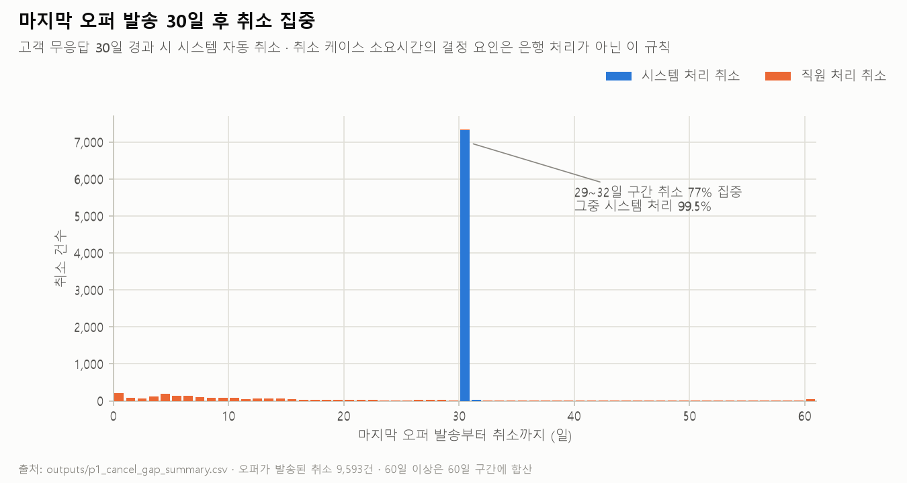

# Phase 1 — 프로세스 현황

> 2026-09-11 · 진행계획·기록 [`plans/phase-01-process-baseline.md`](plans/phase-01-process-baseline.md) · 스크립트 `analysis/04~06` · 테스트 24 passed · 모집단 29,131건 (Phase 0 `in_population`)

## 요약

- 신청이 빠지는 곳은 은행 처리 단계가 아니라 **오퍼 발송 이후 고객 회신 전**이다. 취소 9,692건 중 8,630건이 오퍼를 받은 뒤 회신 없이 멈췄다.
- 케이스 경과시간의 **82.2%를 고객이 쥐고 있다.** 은행 처리 속도만으로 줄일 수 있는 부분은 작다.
- 취소는 **30일 무응답 자동 취소**와 **수동 취소**의 두 유형으로 선명하게 나뉜다.
- 전화 업무의 ate_abort는 거의 모두 케이스의 심사 이동이나 종료와 몇 초 안에 붙어 있다. 실패 표시로 읽기 어렵다.
- `A_Submitted`는 접수 순간 시스템이 기록하는 표식이고, 이 표식의 유무에 따라 성사율이 크게 다르다. 접수 시점 변수 후보다.

## 1. 흐름과 이탈 위치

마일스톤별 도달 케이스 수 (`outputs/p1_funnel_by_outcome.csv`):

| 마일스톤 | 취소 | 거절 | 성사 | 전체 |
|---|---|---|---|---|
| A_Create Application | 9,692 | 3,441 | 15,998 | 29,131 |
| A_Submitted | 7,033 | 2,473 | 9,336 | 18,842 |
| O_Create Offer | 9,692 | 3,441 | 15,998 | 29,131 |
| O_Sent | 9,593 | 3,408 | 15,998 | 28,999 |
| O_Returned | 910 | 3,247 | 15,998 | 20,155 |
| A_Validating | 963 | 3,289 | 15,998 | 20,250 |
| A_Incomplete | 907 | 1,208 | 11,683 | 13,798 |

취소·거절 케이스가 종료 직전에 도달한 가장 뒤 마일스톤 (`outputs/p1_dropout_last_milestone.csv`):

| 마지막 마일스톤 | 취소 | 거절 |
|---|---|---|
| O_Create Offer | 99 | 33 |
| A_Complete (오퍼 발송 직후) | 8,630 | 119 |
| A_Validating | 56 | 2,081 |
| A_Incomplete | 907 | 1,208 |

- **취소는 고객 회신 전에 일어난다.** 취소 케이스는 거의 전부 오퍼를 받았지만(O_Sent 9,593건), 회신한 것은 910건이다.
- **거절은 서류가 들어온 뒤에 일어난다.** 거절 케이스 대부분이 심사(A_Validating) 또는 보완 요청(A_Incomplete)까지 갔다. 은행의 심사 판단이다.

## 2. 구간 소요

`outputs/p1_stage_durations.csv` (일):

| 구간 | 케이스 | 중앙값 | p90 |
|---|---|---|---|
| 신청 생성 → 첫 오퍼 발송 | 28,999 | 0.95 | 3.64 |
| 첫 오퍼 발송 → 첫 회신 | 20,155 | 7.80 | 18.14 |
| 첫 회신 → 성사 | 15,998 | 4.96 | 16.00 |
| 첫 회신 → 거절 | 3,247 | 4.02 | 9.81 |
| 첫 오퍼 발송 → 취소 | 9,593 | 30.70 | 33.92 |

은행이 오퍼를 내보내는 데는 하루 안팎이 걸린다. 고객 회신에는 1주 이상 걸리고, 회신하지 않은 고객은 30일 무렵에 정리된다.

## 3. 은행 보유 vs 고객 보유 — 공식 질문 1에 대한 답

케이스는 은행에서 시작한다. 오퍼 발송이나 보완 요청 시점에 고객에게 넘어가고, 오퍼 회신이나 심사 재개 시점에 은행으로 돌아온다고 보고 경과시간을 나눴다 (`outputs/p1_holder_time_by_outcome.csv`). 두 시간을 더한 값은 케이스 경과시간과 최대 0.0012일 차이로 일치한다 (`05_holder_and_cancel.py` 출력).

| 결과 | 케이스 | 은행 보유 중앙값(일) | 고객 보유 중앙값(일) | 고객 보유 비중 |
|---|---|---|---|---|
| 취소 | 9,692 | 1.14 | 30.69 | 92.6% |
| 거절 | 3,441 | 4.64 | 8.83 | 67.5% |
| 성사 | 15,998 | 3.91 | 10.07 | 74.8% |
| 전체 | 29,131 | 2.89 | 13.89 | 82.2% |

(고객 보유 비중 = 고객 보유 일수 합 / 전체 일수 합)

**답:** 케이스 경과시간 대부분은 고객 입력을 기다리는 시간이다. 성사 케이스만 봐도 고객 보유가 은행 보유의 두 배를 넘는다. 은행이 쥔 시간 안에도 대기가 섞여 있지만, 그것을 전부 없애도 줄어드는 몫은 전체의 일부다. 이것이 Phase 8의 예비 결론이다.

## 4. 30일 무응답 자동 취소 규칙

`outputs/p1_cancel_gap_summary.csv`:

| 항목 | 값 |
|---|---|
| 취소 케이스 / 오퍼 발송된 취소 | 9,692 / 9,593 |
| 시스템 계정(User_1)이 취소한 비중 | 76.1% |
| 마지막 오퍼 발송 → 취소 간격 중앙값 / p10 / p90 | 30.67일 / 7.02일 / 30.91일 |
| 29~32일 구간에 들어가는 비중 | 77.0% |
| 그 구간 안 취소 중 시스템 처리 비중 | 99.5% |
| 그 구간 밖 취소 중 시스템 처리 비중 | 0.0% |

**판정:** 규칙이 실재한다 (P7 확정). 29~32일 구간의 취소는 사실상 전부 시스템이 처리했고, 구간 밖 취소는 전부 직원이 처리했다. 그러므로 취소는 두 유형이다.
- **자동 취소:** 오퍼 발송 후 30일 무응답. 고객이 반응하지 않은 결과다.
- **수동 취소:** 직원이 더 이른 시점에 처리했다. 고객 요청 등으로 추정되지만, 로그에 사유는 없다.

"처리가 30일을 넘으면 성사율이 급락한다"(KPMG p.3·p.12)는 이 규칙이 만든 결과다. 소요시간을 성사의 원인으로 해석하지 않는다.

## 5. 전화 업무 ate_abort의 인접 전이

로그에 통화 결과·중단 사유 코드가 없어서, 이 절은 **사유를 판정하지 않는다.** ate_abort 이벤트의 ±60초 안에 어떤 케이스 전이가 붙는지만 본다 (`outputs/p1_ate_abort_context.csv`).

| 활동 | ate_abort | 심사 이동(A_Validating) | 종료(A_ 종료·오퍼 취소·거절) | 인접 전이 없음 |
|---|---|---|---|---|
| W_Call after offers | 28,726 | 19,353 (67.4%) | 8,301 (28.9%) | 1,072 (3.7%) |
| W_Call incomplete files | 18,404 | 13,516 (73.4%) | 4,878 (26.5%) | 10 (0.1%) |

- 전화 업무의 ate_abort는 거의 모두 케이스가 심사로 넘어가거나 닫히는 순간에 함께 기록된다. **케이스 진행에 따라 콜 업무가 자동으로 닫히는 순서와 부합한다.**
- 인접 전이가 없는 1,072건(오퍼 후 전화)은 대부분 오퍼 발송 직후 단계(A_Complete) 뒤에 있고, 직전 케이스 이벤트로부터의 간격 중앙값이 88.4시간이다 (`outputs/p1_ate_abort_unmatched_prev.csv`, `06_ate_abort_context.py` 출력). "방치"로 읽을 수 있는 후보는 많아야 이 규모다.
- **sap-btm 해석과의 관계:** sap-btm은 ate_abort를 실패·방치로 보고 "고객 접촉 업무 완료율 5.4%"를 제시했다. 이 결과는 그 해석과 충돌한다. sap-btm 문서를 고치는 것은 이 프로젝트의 범위 밖이다. 여기서는 그 수치를 쓰지 않는다.

## 6. A_Submitted — 접수 시점 변수 후보

`outputs/p1_submitted_channel.csv`, `04_process_funnel.py` 출력:

| A_Submitted | 케이스 | 성사율 | 취소율 | 거절률 |
|---|---|---|---|---|
| 있음 | 18,842 | 49.5% | 37.3% | 13.1% |
| 없음 | 10,289 | 64.7% | 25.8% | 9.4% |

- 전부 시스템 계정(User_1)이 기록했고, 신청 생성 후 중앙값 0.1초(p90 1.1초) 안에 찍힌다. **접수 순간에 결정되는 값이다.** 결과 누수가 아니다.
- 신규 대출(New credit)에만 있다. 한도 증액(Limit raise) 3,162건은 모두 이 표식이 없다. 신청 유형과 겹치므로 Phase 4에서는 신규 대출 안에서 따로 비교한다.
- 표식의 의미(예: 고객의 온라인 직접 제출)는 공식 문서로 확인하지 못했다. 이름을 붙이지 않고 "A_Submitted 유무"로만 쓴다.

## 7. 다음 Phase로 넘기는 것

- **Phase 2 (공수):** 전화 업무의 ate_abort는 케이스 전이에 따른 종료이므로, 인스턴스의 active_hours는 그대로 공수로 쓸 수 있다. 대기 시간은 고객 보유 구간과 겹치므로 공수에 넣지 않는다.
- **Phase 3 (방법론):** 30일 규칙 확정. 소요시간은 원인 변수에서 제외한다.
- **Phase 4 (세그먼트):** 접수 시점 변수에 `A_Submitted 유무`를 추가한다 (신규 대출 안에서 비교).
- **Phase 7 (실패 공수):** 취소를 자동(30일 무응답)과 수동으로 나눈다. 자동 취소의 레버는 오퍼 발송 후 접촉 정책이고, 거절의 레버는 심사 앞단이다.
- **Phase 8 (개입 판정):** 예비 결론은 "처리 속도 개선만으로는 풀리지 않는다"이다 (고객 보유 82.2%).
