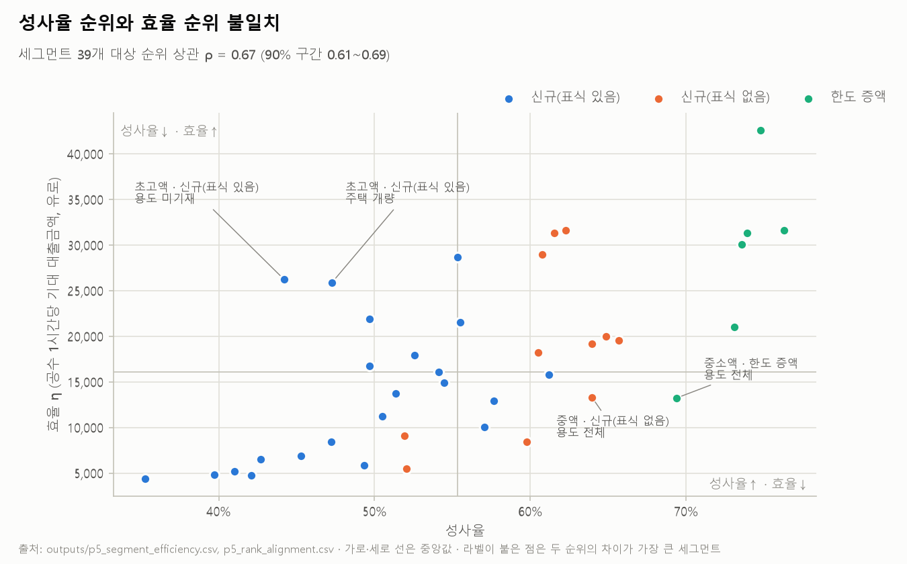
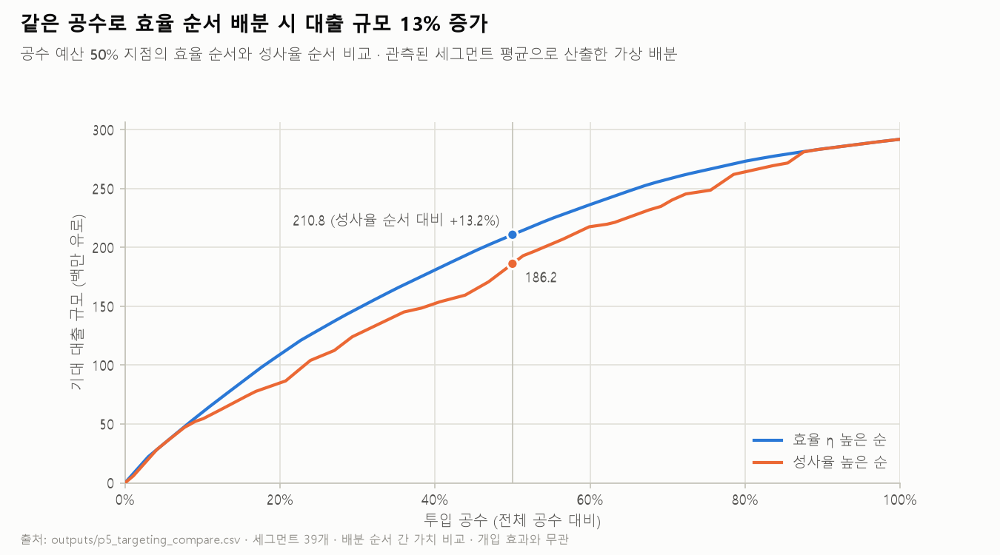

> 한국어 · [English](05_expected_value.en.md)

# Phase 5 — 효율 지표 산출

> 2026-09-11 · 진행계획·기록 [`plans/phase-05-efficiency.md`](plans/phase-05-efficiency.md) · 스크립트 `analysis/13~14` · 테스트 47 passed · 세그먼트 39개(300건 이상, 28,243건)

## 요약 — 핵심 질문에 대한 답

**"성사율이 높은 신청과 실제로 이익이 되는 신청은 같은가?" → 같지 않다.**

- 세그먼트 39개의 **성사율 순위와 효율(η) 순위의 상관은 0.669**다. 부트스트랩 90% 구간(0.610\~0.692)이 모두 판정 경계 0.7 아래에 있다.
- 두 순위가 어긋나는 방향은 뚜렷하다. **성사율이 높은 소액·중액 신청은 효율이 낮고, 성사율이 낮은 대형 신규 신청은 효율이 높다.**
- 같은 공수를 성사율 순서가 아니라 η 순서로 쓰면, 공수 예산의 절반에서 **확보되는 대출 규모가 13.2% 많다** (가상 배분).
- 참조 인건비(57.6유로/시간)에서는 모든 세그먼트가 흑자다. 가장 불리한 세그먼트도 이자 중 순마진이 **7.95%** 이상이면 본전이다. 따라서 결론은 부호 불일치가 아니라 **효율 격차**다. 필요 순마진 비중은 세그먼트 간 **13.6배** 차이 나고, 이 배율은 인건비 가정과 무관하다.

Amplitude 프로젝트의 결론("많이 사는 사람이 아니라 적게 사는 사람이 타겟")과 같은 구조다. 여기서는 **"성사율이 높은 신청이 아니라 규모가 큰 신청"**에 공수를 먼저 써야 한다.

## 1. 성사율 순위 vs η 순위

`outputs/p5_rank_alignment.csv` (Spearman, 39개 세그먼트):

| R × E 조합 | ρ(성사율, η) | ρ(성사율, R̄) | ρ(성사율, Ē) |
|---|---|---|---|
| **수락 금액 × 작업시간 (주)** | **0.669** (90% 구간 0.610\~0.692) | 0.454 | 0.219 |
| 금액×기간 × 작업시간 | 0.685 | 0.533 | 0.219 |
| 수락 금액 × 이벤트 수 | 0.596 | 0.454 | 0.661 |
| 금액×기간 × 이벤트 수 | 0.613 | 0.533 | 0.661 |

(구간은 부트스트랩 반복 2,000회, 시드 0으로 계산했다. 시드를 0\~4로 바꿔도 하한은 0.607\~0.610, 상한은 0.692\~0.694로 다섯 번 모두 판정 경계 0.7 아래다 (`outputs/p5_rho_ci_seeds.csv`). 2026-09-11에 반복 수를 200회에서 올렸다. 200회로 처음 보고한 구간은 0.609\~0.691이었고, 그때는 시드만 바꿔도 상한이 0.687\~0.699로 움직였다. 기록: [`plans/ops-bootstrap.md`](plans/ops-bootstrap.md))

- **판정 (규칙 ①):** 주 조합 ρ = 0.669 < 0.7이고, 구간 상한(0.692)도 0.7 아래다. 시드를 바꿔도 상한은 0.692\~0.694다 → **"다르다"**. 네 조합 모두 0.7 미만이다. 다만 경계까지의 여유는 약 0.006으로 크지 않다.
- **어긋남의 원인:** 성사율은 대출 규모(R̄)와 약하게만 같이 움직인다(0.454). η는 성사율과 규모의 곱이다. 그래서 성사율만 보면 규모의 차이를 놓친다. 공수(Ē)와 성사율의 관계는 더 약하다(0.219).
- **η 순위 자체는 견고하다 (규칙 ④):** η 4조합 간 순위 상관은 모두 0.975 이상이다 (`outputs/p5_eta_rank_corr.csv`). 주 조합의 순위를 그대로 쓴다.

## 2. 어긋나는 세그먼트

성사율 순위와 η 순위가 10계단 이상 차이 나는 세그먼트는 10개다 (`outputs/p5_mismatch.csv`). 순위 1 = 최고.

| 세그먼트 | n | 성사율 | R̄(유로) | η | 성사율 순위 | η 순위 |
|---|---|---|---|---|---|---|
| **성사율은 높은데 효율은 낮음** | | | | | | |
| 중소액 · 한도 증액 · 용도 전체 | 369 | 0.694 | 9,170 | 13,235 | 6 | 25 |
| 중액 · 신규(표식 없음) · 용도 전체 | 960 | 0.640 | 14,485 | 13,318 | 10 | 24 |
| 중소액 · 신규(표식 없음) · 그 외 용도 | 579 | 0.598 | 9,514 | 8,473 | 16 | 30 |
| 소액 · 신규(표식 없음) · 용도 전체 | 686 | 0.520 | 6,136 | 5,512 | 24 | 35 |
| 중소액 · 신규(표식 있음) · 주택 개량 | 1,015 | 0.570 | 9,820 | 10,024 | 18 | 28 |
| **성사율은 낮은데 효율은 높음** | | | | | | |
| 초고액 · 신규(표식 있음) · 용도 미기재 | 543 | 0.442 | 39,184 | 26,240 | 34 | 9 |
| 초고액 · 신규(표식 있음) · 주택 개량 | 755 | 0.473 | 37,463 | 25,921 | 31 | 10 |
| 초고액 · 신규(표식 있음) · 자동차 구입 | 336 | 0.497 | 32,334 | 21,885 | 28 | 11 |
| 초고액 · 신규(표식 있음) · 대출 대환 | 1,003 | 0.553 | 40,001 | 28,711 | 20 | 8 |
| 고액 · 신규(표식 있음) · 용도 미기재 | 477 | 0.497 | 21,776 | 16,796 | 29 | 19 |

- 성사율은 높지만 효율이 낮은 쪽은 **소액·중액**이다. 신규(표식 없음)이나 한도 증액처럼 성사가 잘 되는 경로라도, 대출 규모가 작으면 공수 대비 효율이 낮다.
- 성사율은 낮지만 효율이 높은 쪽은 **25,000유로 초과의 신규(표식 있음)**이다. 두 건 중 한 건 이상이 성사되지 않지만, 성사되면 규모가 크다.
- 사분면 분포(중앙값 기준): 성사율↑·효율↑ 14, 성사율↓·효율↓ 13, **성사율↑·효율↓ 6, 성사율↓·효율↑ 6** (`13_rank_alignment.py` 출력).

## 3. 같은 공수, 다른 배분

공수 예산을 성사율이 높은 세그먼트부터 쓸 때와 η가 높은 세그먼트부터 쓸 때, 확보되는 기대 대출 규모(Σ 신청 수 × 성사율 × R̄)를 비교했다 (`outputs/p5_targeting_compare.csv`).

| 공수 예산 | 성사율 순서 (백만 유로) | η 순서 (백만 유로) | η 순서의 이득 |
|---|---|---|---|
| 25% | 107.0 | 129.9 | +21.4% |
| 50% | 186.2 | 210.8 | **+13.2%** |
| 75% | 248.1 | 265.9 | +7.2% |

- **판정 (규칙 ③):** 예산 50%에서 이득이 5%를 넘는다 → **성사율 기준 배분은 실질적으로 비효율이다.**
- 공수가 부족할수록(예산이 작을수록) 순서의 차이가 커진다.
- **주의:** 관측된 세그먼트 평균으로 계산한 가상 배분이다. 공수를 옮겼을 때 세그먼트의 성사율이 그대로라는 보장은 없다 (P3). 이 수치는 "순서를 바꿀 가치가 있는가"를 보여줄 뿐, 개입의 효과를 추정한 것이 아니다.

## 4. c/m 스캔과 필요 최소 순마진 비중

**c/m 스캔** (`outputs/p5_cm_scan.csv`, 로그 축 41점, 437\~426,026):

| c/m (유로/시간) | 음수 세그먼트 | 신청 비중 | 공수 비중 |
|---|---|---|---|
| 4,094 이하 | 0 | 0% | 0% |
| 4,863 | 3 | 11.3% | 9.6% |
| 9,677 | 11 | 31.3% | 28.2% |
| 16,214 | 20 | 56.2% | 52.9% |
| 32,266 | 38 | 97.3% | 97.0% |
| 45,516 이상 | 39 | 100% | 100% |

첫 세그먼트가 음수로 돌아서는 지점은 c/m = 4,374(소액 · 신규(표식 있음) · 용도 미기재)다.

**필요 최소 순마진 비중** — 참조 인건비 57.6유로/시간에서 EV ≥ 0이 되려면 총이자 중 순마진이 차지해야 하는 최소 비중 (`outputs/p5_margin_share.csv`):

| 세그먼트 | η_I (유로/시간) | 필요 최소 순마진 비중 |
|---|---|---|
| 소액 · 신규(표식 있음) · 자동차 구입 | 724 | **7.95%** (최고) |
| 소액 · 신규(표식 있음) · 용도 미기재 | 778 | 7.40% |
| 소액 · 신규(표식 있음) · 대출 대환 | 872 | 6.60% |
| … | | |
| 금액 미기재 · 한도 증액 · 용도 미기재 | 7,381 | 0.78% |
| 초고액 · 한도 증액 · 용도 전체 | 9,858 | **0.58%** (최저) |

- **판정 (규칙 ⑤):** 가장 불리한 세그먼트도 순마진이 총이자의 7.95% 이상이면 흑자다. 이 비중이 현실적인지는 판정하지 않는다 (조달비용·신용손실 자료 없음, P6).
- **인건비 가정의 영향:** 참조값에는 간접비(시스템, 공간, 관리)가 빠져 있다. 실제 시간당 비용이 참조값의 k배라면 모든 세그먼트의 필요 비중도 k배가 된다. 그래도 **세그먼트 간 배율 13.6배는 변하지 않는다** (`14_targeting_and_scan.py` 출력).
- 따라서 이 프로젝트의 결론은 "어느 세그먼트가 손해인가"가 아니라 **"같은 공수가 세그먼트에 따라 13.6배 다른 가치를 만든다"**이다.

## 5. 반전 시나리오 점검 (설계 단계에서 정의한 3종)

| 시나리오 | 판정 | 근거 |
|---|---|---|
| 원 설계의 반전 — 성사율은 높은데 기대값이 음수인 구간 | **부호로는 미관측, 순위로는 관측** | 참조 인건비에서 전 세그먼트 흑자(4장). 대신 성사율 상위의 소액·중액 세그먼트가 η 하위에 있다(2장) |
| 1. 복수 오퍼의 역전 (소액 구간) | Phase 6에서 판정 | 소액 구간이 η 최하위라는 전제는 확인됨 |
| 2. 고액 신청의 함정 (공수 비선형 증가) | **기각** | 금액 구간이 올라가도 공수는 0.532 → 0.735시간(1.38배)만 늘고, R̄은 6,294 → 38,379유로로 늘어난다 (`outputs/p4_axis_groups.csv`, `p4_axis_spread.csv`). 고액 신청은 가장 효율적이다 |
| 3. 실패 케이스의 공수 비중 | Phase 7에서 판정 | 출발값: 취소 17.8%, 거절 16.4% (Phase 2) |

## 6. 다음 Phase로 넘기는 것

- **Phase 6:** 복수 오퍼의 증분 효과를 세그먼트 안에서 η 기준으로 본다. 반전 시나리오 1의 자리인 **소액 구간**을 먼저 본다.
- **Phase 7:** 실패 공수를 세그먼트별로 나누고, 성사율↑·효율↓ 세그먼트의 실패 공수 비중을 따로 본다.
- **Phase 9:** 요구사항 1("접수 시점에 구간 판별")의 근거가 생겼다. 접수 시점 변수만으로 만든 세그먼트가 성사율과 다른 효율 순위를 만들고, 순서를 바꾸면 대출 규모가 13.2% 늘어난다.
- **계산기(MVP):** `outputs/p5_calculator_input.csv`, `outputs/p5_calculator_meta.json`. 사용자가 시간당 비용과 순마진 비중을 바꿔 가며 세그먼트의 부호와 순위를 보는 도구의 입력이다.
