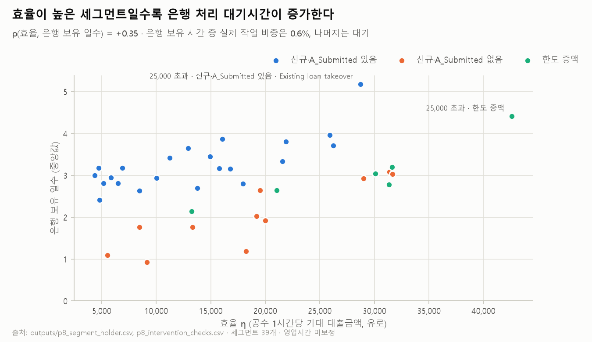

# Phase 8 — 개입 가능 여부 판정

> 2026-09-11 · 진행계획·기록 [`plans/phase-08-intervention.md`](plans/phase-08-intervention.md) · 스크립트 `analysis/19` · 테스트 58 passed · 세그먼트 39개(28,243건)

## 요약 — 무엇을 권고하고 무엇을 권고하지 않는가

- **처리 속도 개선만으로는 풀리지 않는다.** 세그먼트 39개 모두에서 고객이 경과시간의 과반(73~89%)을 쥐고 있다.
- **은행은 지금 효율 순서로 처리하지 않는다. 오히려 반대다.** 효율(η)이 높은 세그먼트일수록 은행이 쥐고 있는 기간이 **길다**(ρ = +0.346). 은행이 쥐고 있는 시간 중 실제 작업은 0.6%뿐이다. 나머지는 대기다.
- **권고 1순위는 "접수 시점 세그먼트에 따른 처리 우선순위 조정"이다.** 다만 인력이 실제로 제약이라는 전제가 필요하고, 이 전제는 데이터로 완전히 확인하지 못했다. 그래서 등급은 **조건부**다.
- 첫 상담 단일 오퍼와 오퍼 발송 후 접촉 정책은 **A/B 검증 후** 판단한다. 심사 앞단 필터와 무응답 신청의 앞단 경량화는 **보류**한다.
- 수단의 효과를 재려면 로그에 없는 필드 7종이 필요하다. 이것이 Phase 9의 데이터 요구사항이다.

## 1. 처리 속도는 해법이 아니다 — 세그먼트 단위 확인 (판정 1)

Phase 1의 보유 주체 규칙으로 세그먼트마다 경과시간을 구분했다 (`outputs/p8_segment_holder.csv`). 고객 보유는 은행이 고객의 회신을 기다리는 구간이고, 은행 보유는 신청이 은행 쪽에 있는 구간이다. 두 구간의 합이 경과시간이다.

| 항목 | 값 |
|---|---|
| 고객 보유 과반 세그먼트 수 (경과시간 기준) | **39 / 39** (`outputs/p8_intervention_checks.csv`) |
| 고객 보유 비중 범위 | 73.2%(초고액 · 한도 증액 · 용도 전체) ~ 89.4%(중소액 · 신규(표식 없음) · 자동차 구입) |
| 은행 보유 일수 중앙값 범위 | 0.93일(중소액 · 신규(표식 없음) · 자동차 구입) ~ 5.18일(초고액 · 신규(표식 있음) · 대출 대환) |

**판정:** 세그먼트 단위에서도 확인됐다. 은행 처리가 0초가 되더라도 어느 세그먼트에서든 경과시간의 대부분은 남는다. **처리 속도 개선을 단독 수단으로 권고하지 않는다.**

참고: 효율(η)과 고객 보유 비중의 순위 상관은 −0.309다. 효율이 높은 세그먼트일수록 은행이 쥐는 몫이 상대적으로 크다. 최상위 세그먼트(초고액 · 한도 증액 · 용도 전체)는 26.8%다. 그러므로 속도는 **효율이 높은 세그먼트에 한해, 우선순위 조정과 결합될 때** 의미가 있다.

## 2. 현재 처리 순서는 효율을 반영하는가 (판정 2·3)

| 판정 | 값 | 결과 |
|---|---|---|
| ② 효율(η)과 은행 보유 일수의 순위 상관 | **+0.346** | 현재 순서는 η를 반영하지 않는다. 방향은 오히려 반대다 → **순서 변경의 전제 성립** |
| ③ 실제 작업 시간 비중 (은행 보유 시간 대비, 세그먼트 중앙값) | **0.61%** | 대기열 신호 (영업시간 미보정) |

(`outputs/p8_intervention_checks.csv`)

- **효율이 높은 세그먼트가 더 오래 기다린다.** 25,000유로 초과 대형 신청은 은행 보유 일수 중앙값이 2.9~5.2일이다. 1만 유로 이하 · 신규(표식 없음) 세그먼트는 0.9~1.8일이다.
- **은행 쪽 시간은 거의 전부 대기다.** 모든 세그먼트에서 은행 보유 시간 중 작업 비중이 0.5~3.0%다. 야간·주말을 빼더라도 대기가 대부분이라는 방향은 바뀌지 않는다. 다만 이 보정은 하지 않았으므로 정확한 대기 비중은 주장하지 않는다.
- **접수 경로에 따라 은행 보유 기간이 다르다.** 신규(표식 없음) 세그먼트는 은행 보유 일수가 짧다(0.9~3.1일). 신규(표식 있음)은 길다(2.4~5.2일). A_Submitted의 의미를 알 수 없으므로(Phase 1) 원인은 해석하지 않는다.
- **해석의 한계:** 대형 신청이 은행에서 오래 머무는 것은 심사가 더 복잡하기 때문일 수도 있다. 하지만 작업 시간 비중은 대형 세그먼트도 다른 세그먼트와 같은 범위다(0.5~1.4%). 그러므로 더 오래 **작업**하는 것이 아니라 더 오래 **기다리는** 것으로 읽는다.

## 3. 개입 수단 매트릭스

| 수단 | 크기 | 근거의 성격 | 확인된 전제 | 확인되지 않은 전제 | **등급** |
|---|---|---|---|---|---|
| **η 순 처리 우선순위 조정** | 공수 예산 50%에서 대출 규모 +13.2% (Phase 5). 저효율 세그먼트는 공수의 44~52%를 실패에 씀 (Phase 7) | 관측값 기반 가상 배분 | 접수 시점 세그먼트 판별(Phase 4) · 현재 순서 η 미반영(ρ +0.346) · 대기열 신호(작업 0.6%) | 인력이 실제 제약인가(근무시간·인원 자료 없음) · 순서를 바꿔도 세그먼트 성사율이 유지되는가 | **조건부 — 1순위** |
| **첫 상담 단일 오퍼** | 같은 상담 복수 제시의 성사율 −2.6~−5.5%p (Phase 6) | 관측 연관 | 두 정의·층화 후에도 방향 같음 | 음(−) 연관이 인과인가 | **검증 후 (A/B)** |
| **오퍼 발송 후 접촉 정책** | 공수 절감 3.5%(작음). 무응답 7,375건의 회신 전환 효과는 미상 (Phase 7) | 측정 불가 | 무응답 취소의 99.5%가 시스템 30일 규칙 (Phase 1) | 접촉이 회신을 늘리는가(통화 결과 없음) | **검증 후 (A/B)** |
| **심사 앞단 필터 (거절)** | 규칙상 근거 미충족. 완화 시 5.6% (Phase 7) | 비율 차이만 확인 | 거절률 세그먼트 간 4.6배, 구간 분리 | 거절 공수가 식별 가능한 곳에 몰리는가(34% < 40%) | **보류** |
| 무응답 가능성 높은 신청의 앞단 경량화 | 자동 취소의 발송 전 신청서 완성 공수 6.8% (Phase 7) | 비율 차이만 확인 | 자동 취소율 세그먼트 간 3.3배 | 자동 취소 공수가 식별 가능한 곳에 몰리는가(35.8% < 40%) | **보류** |
| 처리 속도 개선 단독 | 은행 보유 몫 11~27% (세그먼트별) | 구조적 상한 | 39/39 세그먼트 고객 과반 | — | **권고하지 않음** |

## 4. 조건부 권고 (P8 형식)

1. **η 순 처리 우선순위 조정 — 1순위**
   - **전제가 성립하면 채택:** 인력(공수)이 실제 제약이라면, 접수 시점 세그먼트의 η 순서로 처리 대기열의 우선순위를 정한다. 지금은 효율이 높은 세그먼트가 더 오래 기다리므로 순서를 뒤집는 것만으로도 방향이 맞다.
   - **전제가 성립하지 않으면:** 인력에 여유가 있어 모든 신청이 처리된다면, 순서 변경은 대기 시간을 재배분할 뿐이다. 대출 규모 이득(+13.2%)은 기대하지 않는다. 이 경우 효과는 고효율 세그먼트의 대기 단축에 그친다.
   - **전제 확인 방법:** 근무시간·인원 자료로 영업시간 기준 대기열 길이를 잰다. 먼저 한 세그먼트 묶음에 우선순위를 적용해 성사율과 대기 시간을 사후 측정한다 (요구사항 3).
2. **첫 상담 단일 오퍼 — A/B 검증 후.** 첫 상담에서 복수 오퍼를 제시하는 군과 단일 오퍼 군을 무작위로 나눈다. 성사율과 공수를 비교한다. 음(−) 연관이 인과로 확인되면 기본값을 단일 오퍼로 바꾼다.
3. **오퍼 발송 후 접촉 정책 — A/B 검증 후.** 공수 절감 수단이 아니다. 무응답 고객의 회신 전환 수단이다. 접촉 시점·빈도를 달리한 군을 두고 **회신률**을 잰다. 이를 위해 통화 결과 코드가 먼저 기록돼야 한다.
4. **심사 앞단 필터·앞단 경량화 — 보류.** 실패 비율은 접수 시점 세그먼트로 갈리지만, 공수가 몰려 있지 않아 사전 규칙을 충족하지 못했다. 1번 우선순위 조정이 저효율 세그먼트의 실패 공수를 함께 줄이는 방향이므로, 1번의 사후 측정 결과를 보고 다시 판단한다.

## 5. 권고하지 않는 것과 그 이유

- **처리 속도 개선 단독:** 39개 세그먼트 모두 고객 보유가 과반이다. 은행 처리 시간을 없애도 줄어드는 몫은 세그먼트별 11~27%다.
- **소요시간을 줄이면 성사율이 오른다는 주장:** 30일 자동 취소 규칙 때문에 소요시간과 성사는 규칙으로 묶여 있다 (P7). 인과로 쓰지 않는다.
- **복수 오퍼를 늘리는 정책:** 복수 오퍼의 우위는 나중 상담에서만 나오고 선택 편향이 섞인 상한이다. 추가 오퍼의 증분 효율도 6개 금액 구간 중 5개에서 평균보다 낮다 (Phase 6).

## 6. Phase 9·10으로 넘기는 것

**수단별로 필요한 역량 (Phase 9 기능 요구의 입력):**

| 역량 | 필요한 수단 |
|---|---|
| 접수 시점 세그먼트 판별 (금액 구간 · 접수 경로 · 용도) | η 순 우선순위, 첫 상담 오퍼 규칙, (보류) 앞단 필터 |
| 처리 대기열 우선순위의 세그먼트별 분기 | η 순 우선순위 |
| 오퍼 제시 규칙의 세그먼트별 분기 | 첫 상담 단일 오퍼 |
| 오퍼 발송 후 접촉 규칙의 분기와 결과 기록 | 접촉 정책 |
| 무작위 배정(A/B)과 사후 측정 · 규칙 되먹임 | 전 수단 |

**데이터 공백 (Phase 9 데이터 요구의 입력):** 수단의 효과를 재려면 필요하지만 로그에 없는 필드다.

| 없는 필드 | 막혀 있는 판단 |
|---|---|
| 통화 결과 코드 | 접촉 정책의 회신 전환 효과, ate_abort의 의미 (Phase 1) |
| 취소 사유 | 수동 취소의 레버, 자동 취소 전 고객 의사 |
| 오퍼 요청 주체 (고객 요청 / 은행 제안) | 추가 오퍼 레버의 주체 (Phase 0·6) |
| 대출 실행 이후 성과 (연체·부도·조기상환) | 순마진, 세그먼트별 필요 순마진 비중의 판정 (Phase 3·5) |
| 조달비용·순마진 | 손익 부호의 판정 (Phase 3) |
| 근무시간·인원 (가용 공수) | 인력 제약 여부 — 1순위 수단의 전제 |
| A_Submitted의 업무 정의 | 접수 경로 축의 해석 (Phase 1) |

**Phase 10 입력:** 수단별 등급(1순위 조건부 · A/B 2개 · 보류 2개 · 비권고 1개). Phase 10에서는 세 경로를 비교한다. 규정·운영 변경만으로, 프로세스 마이닝·자동화 도구로, 코어 시스템 변경으로 각각 **어느 수단을 어디까지 실현하고 어느 데이터 공백을 메우는가**를 본다.
