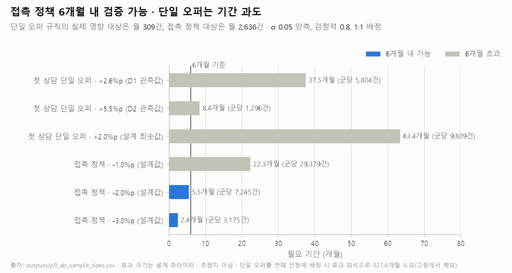

> English · [한국어](09_requirements.md)

# Phase 9 — Requirements

> 2026-09-11 · plan and record [`plans/phase-09-requirements.md`](plans/phase-09-requirements.md) · script `analysis/20`

## Summary

- The business analysis from phases 1–8 becomes **7 functional, 8 data, 5 measurement and 6 non-functional requirements**. No product is named. Every requirement carries its evidence (phase, output file, figure) and an acceptance test.
- Three sit at the centre: **segment identification at intake (FR1), queue priority branching by segment (FR2), and post-hoc measurement with feedback into the rules (FR6).** Together they are the minimum set that realises the first-choice lever from Phase 8.
- **The measurement requirements were sized against monthly volume.** Contact policy after the offer can be verified by A/B (5.5 months to detect a 2 percentage point drop in the auto-cancellation rate). The single-offer rule reaches only 309 decision points a month, which puts an A/B test at 8 to 38 months; it therefore moves to **a reversible pilot with before-and-after comparison**, and its priority drops from Should to Could.
- On current evidence **a rule table over four intake variables is enough.** No predictive model is required.

## 0. How to read this

- **Product neutral:** requirements state what must be possible. How to realise it is Phase 10's subject.
- **Format:** ID · condition · acceptance · evidence · priority.
- **Priority (MoSCoW):** carried over from the Phase 8 grades. The first-choice lever and the capabilities common to every lever are Must, A/B candidates are Should, a pilot rule whose verification is impractical is Could, and levers on hold are Won't for this scope.
- **The simplest sufficient means is not blocked:** a segment is one cell in a rule table of 39 (plus 5 below 300 applications) built from four intake variables (Phase 4). Requirements are written so that either a rule table or a model can satisfy them.

## 1. Functional requirements (FR)

### FR1 · Segment identification at intake — **Must**
- **Condition:** when intake completes, label the application using only the four fields settled at that moment (requested amount, loan purpose, application type, intake route marker). Derivation rules: amount 0 becomes the "amount not stated" band; the three uninformative purposes become "purpose not stated" and purposes under 300 applications become "minor purposes"; the crossing is hierarchical in the order amount → intake route → purpose, with a minimum cell size of 300.
- **Prohibited:** values created during processing (offer terms, offer count) and values that reflect the outcome (CreditScore, Selected, Accepted) are not rule inputs.
- **Acceptance:** ① every application receives exactly one segment at intake ② the field values used match the intake snapshot (DR8) ③ replaying historical logs reproduces the Phase 4 segment table (44 segments, 39 of them at least 300).
- **Evidence:** all three axes separate η — amount 5.84x, route 2.21x, purpose 1.50x, all with separated 90% intervals (Phase 4, `outputs/p4_axis_spread.csv`). CreditScore is non-zero only on accepted offers, 88.6% versus 0.0% for cancelled and rejected (Phase 0). The intake route marker is written within 0.1 seconds of creation (median, Phase 1).

### FR2 · Queue priority branching by segment — **Must**
- **Condition:** the order of bank work items (assessment, completing the application, handling completion requests) can be set per segment. Priorities live in a table an operator can edit (NFR4).
- **Acceptance:** ① a priority change takes effect from the next assignment ② segment-level bank waiting time (FR7) moves in the direction of the rule ③ waiting time for low-priority segments stays under the ceiling (NFR6).
- **Evidence:** the current order runs against η — ρ(segment η, median bank-held days) = +0.346, and only 0.61% of bank-held time is hands-on work (Phase 8, `outputs/p8_intervention_checks.csv`). Allocating in η order yields +13.2% loan volume at half the effort budget (Phase 5, hypothetical reallocation).
- **Premise:** until staffing is confirmed as the real constraint (DR6), keep this to a **pilot scope** (Phase 8, conditional first choice).

### FR3 · Offer rule branching by segment — **Could**
- **Condition:** the default number of offers in the first conversation, and the conditions for creating additional offers, can be set per segment (at minimum per amount band). When an additional offer is created, record who requested it (DR3).
- **Acceptance:** ① offer creation follows the rule default ② exceeding the default leaves a reason.
- **Evidence:** multiple offers within the first conversation convert below single offers — −2.64%p (D1) and −5.49%p (D2) after stratification. The incremental η of additional offers ranges 3,485–12,153 across amount bands (Phase 6).
- **Priority change (Should → Could):** the rule changes 309 applications a month at the decision point, and an A/B test would take 8.4–37.5 months (MR2). Verification moves to the pilot in MR3.

### FR4 · Contact rule branching after the offer, with outcomes recorded — **Should**
- **Condition:** timing and frequency of contact after the offer can be set per segment. Every contact attempt records an outcome code (DR1).
- **Acceptance:** ① every attempt has an outcome code ② the last attempt before the 30-day auto-cancellation is recorded.
- **Evidence:** 7,375 auto-cancellations, with post-send effort at 3.5% of the total (Phase 7). 99.5% of those cancellations come from the system's 30-day rule (Phase 1). Without outcome codes, the meaning of aborted call work could not be judged (Phase 1, chapter 5).
- **Measurement:** verifiable by A/B — 5.5 months to detect −2%p in the auto-cancellation rate, 2.4 months for −3%p (MR2).

### FR5 · Random assignment — **Must**
- **Condition:** when a rule changes, the affected population can be split into arms at random with the assignment recorded. The unit (application or decision point) and the ratio are configurable.
- **Acceptance:** ① assignment is reproducible (seed and assignment log) ② a report checks balance of intake variables across arms.
- **Evidence:** every recommended lever presumes verification (Phase 8). When a rule changes only part of the population, assigning at application level dilutes the effect: assigning the single-offer rule across all applications would need 433,825 per arm (`outputs/p9_ab_sample_sizes.csv`). Hence **assignment at the decision point**.

### FR6 · Post-hoc measurement and feedback — **Must**
- **Condition:** segment metrics (MR1) are recomputed on a schedule and shown next to the rule table. Breaching a guardrail (MR5) raises a review.
- **Acceptance:** ① the segment table refreshes monthly, excluding the most recent intake months until completion reaches 99% ② a before-and-after report accompanies each rule change.
- **Evidence:** without the observation-window rule (monthly completion ≥ 0.99) recent cohorts keep only the fast cases (Phase 0). The η ranking holds above 0.975 across R and E definitions, so monthly recomputation is meaningful (Phase 5).

### FR7 · Queue monitoring — **Must**
- **Condition:** work time and waiting time are measured separately per work item, and bank-held versus customer-held time is shown per segment.
- **Acceptance:** ① computed with the Phase 1 holder rule ② once working-hours data (DR6) arrives, the same view is available on a business-hours basis.
- **Evidence:** customers hold 82.2% of elapsed time (Phase 1) and the majority in all 39 segments (Phase 8). Only 0.61% of bank-held time is hands-on work (Phase 8).
- **Why Must:** it is what confirms FR2's unverified premise (staffing as the constraint) and what measures FR2's effect.

## 2. Data requirements (DR)

| ID | Field | Judgement it unblocks | Related FR | Priority |
|---|---|---|---|---|
| DR1 | Outcome code for contact attempts | Response lift from contact policy, meaning of aborted call work (Phase 1, 7) | FR4 | Should |
| DR2 | Cancellation reason (customer request / no response / other) | The lever behind 2,317 manual cancellations, customer intent before auto-cancellation (Phase 7) | FR4, FR6 | Should |
| DR3 | Who requested the offer (customer / staff) | The owner of the additional-offer lever (Phase 0, 6) | FR3 | Could |
| DR4 | Post-disbursement performance (arrears, default, early repayment) | Net margin, verdict on the required minimum margin share (Phase 3, 5) | FR6 | Should |
| DR5 | Funding cost and net margin (per product or segment) | Verdict on the profitability sign — currently only a required share against a reference cost (Phase 5) | FR6 | Should |
| DR6 | Working hours and headcount (available effort) | Whether staffing constrains — FR2's premise, FR7's business-hours correction (Phase 8) | FR2, FR7 | **Must** |
| DR7 | Business definition of the intake route marker (A_Submitted) | Interpretation of the intake route axis (Phase 1) | FR1 | **Must** |
| DR8 | Intake-time snapshot of the four fields | Guarantees rule inputs were not changed afterwards (Phase 0: the outcome-leakage case) | FR1 | **Must** |

## 3. Measurement requirements (MR)

### MR1 · Metric definitions — **Must**

| Metric | Definition | Source |
|---|---|---|
| Population | Applications with a settled outcome, up to the last intake month with completion ≥ 99% | Phase 0 |
| Conversion | Reaching A_Pending (zero cases differ between the two definitions) | Phase 0 |
| Effort E | Sum of active work intervals on work items (start/resume → next event), capped at the per-activity 99th percentile | Phase 2 |
| R̄ | Mean accepted offer amount among converted applications (sensitivity: amount × term) | Phase 3 |
| η | R̄ × conversion rate / mean E across all applications | Phase 3 |
| Required minimum margin share | Hourly cost / η_I, where η_I is η on total interest | Phase 3, 5 |
| Holder split | Customer from offer sent or completion requested; bank from offer returned or assessment resumed | Phase 1 |
| 30-day auto-cancellation rate | System-account cancellations / applications with an offer sent | Phase 1, 7 |

### MR2 · A/B design and required sample — **Should**

Two-proportion comparison, two-sided, α = 0.05, power 0.8, 1:1 assignment. Monthly inflow is 2,648 applications (mean intake month in the population) (`outputs/p9_ab_sample_sizes.csv`, `20_measurement_design.py` output). **The effect sizes are design parameters, not estimates.**

| Experiment | Assigned population (per month) | Base rate | Target effect (source) | Per arm | Duration | Verdict |
|---|---|---|---|---|---|---|
| Single offer, first conversation | Decision point — applications about to receive several offers (309) | conversion 0.483 | +2.6%p (observed, stratified D1) | 5,804 | 37.5 months | not feasible |
| 〃 | 〃 | 〃 | +5.5%p (observed, stratified D2) | 1,296 | 8.4 months | not feasible |
| 〃 | 〃 | 〃 | +2.0%p (design minimum) | 9,809 | 63.4 months | not feasible |
| 〃 (assigned across all applications, diluted) | All applications (2,648) | conversion 0.534 | +0.3%p (D1 effect × 11.7% affected) | 433,825 | 327.6 months | not feasible |
| Contact policy after the offer | Applications with an offer sent (2,636) | auto-cancellation 0.254 | −1%p (design) | 29,379 | 22.3 months | not feasible |
| 〃 | 〃 | 〃 | **−2%p (design)** | 7,245 | **5.5 months** | **feasible** |
| 〃 | 〃 | 〃 | −3%p (design) | 3,175 | 2.4 months | feasible |

- **Contact policy:** a rule that cuts the auto-cancellation rate by at least 2 percentage points can be settled within six months. Smaller effects are out of reach at this inflow.
- **Single offer in the first conversation:** the rule changes 11.7% of applications (309 a month). Even at the observed association size an A/B test runs past eight months, and assigning across all applications dilutes it beyond feasibility. → replaced by MR3.

### MR3 · Pilot rule with before-and-after comparison (for FR3) — **Could**
- Apply the single-offer default to selected amount bands only, and compare conversion and effort between applied and non-applied bands, before and after (difference in differences).
- **State the limits:** without randomisation the comparison mixes with anything else that changed at the same time, and only large effects are detectable. What justifies the method is that the rule is reversible and cheap to run.

### MR4 · Refresh cycle and segment upkeep — **Must**
- Recompute the segment table and metrics (MR1) monthly.
- When a cell falls below 300 applications, merge it into its parent (the FR1 hierarchy rule).
- Re-check the axis retention criteria (η ratio at least 1.25x with separated 90% intervals) quarterly (Phase 4 decision rule).

### MR5 · Guardrails — **Must**
- During the FR2 pilot, compare waiting time and the 30-day auto-cancellation rate for low-priority segments against their ceilings. Breaching a ceiling reverts to the default rule (NFR5).
- Moving priority can lengthen waiting for low-efficiency segments. Watch whether customer drop-off rises in those segments.

## 4. Non-functional requirements (NFR)

| ID | Requirement | Evidence | Priority |
|---|---|---|---|
| NFR1 | **Explainability:** the segment label and the reason for a priority can be read back as human rules (amount, route, purpose) | Segments are a hierarchical rule table over three axes (Phase 4) | Must |
| NFR2 | **Audit trail:** rule version, effective date, assignment result and exception reasons are recorded | Post-hoc verification of FR3, FR5, FR6 | Must |
| NFR3 | **Data minimisation:** rule inputs are the four intake fields only. Credit information is not used | Outcome-leakage attributes excluded (Phase 0); intake variables alone separate η (Phase 4) | Must |
| NFR4 | **Operator editing:** the rule tables (segment priority, offer defaults, contact rules) can be changed through an approval flow without a code release | Monthly feedback loop (FR6) | Must |
| NFR5 | **Fallback to the default rule:** if rule application fails or a guardrail (MR5) is breached, the default rule resumes | Hypothetical-reallocation evidence (Phase 5), causality unverified (Phase 6) | Must |
| NFR6 | **Ceiling on customer impact:** low-priority segments carry a maximum waiting time | FR2 can lengthen waiting for low-efficiency segments | Must |

## 5. Traceability

| Requirements | Lever realised (Phase 8) | Core evidence | Acceptance in short |
|---|---|---|---|
| FR1 · DR7 · DR8 · NFR1 · NFR3 | Premise of every lever | η gaps across three axes, leakage excluded (Phase 0, 1, 4) | One segment at intake, historical replay matches |
| FR2 · FR7 · DR6 · MR5 · NFR6 | Queue priority in η order (conditional first choice) | ρ +0.346, 0.61% hands-on, +13.2% (Phase 5, 8) | Waiting moves with the rule, ceiling respected |
| FR3 · DR3 · MR3 | Single offer in the first conversation | −2.64 / −5.49%p (Phase 6), A/B 8–38 months (Phase 9) | Default followed, exceptions recorded, before-and-after comparison |
| FR4 · DR1 · DR2 · MR2 | Contact policy after the offer | 7,375 auto-cancellations, 3.5% of effort (Phase 7), A/B 5.5 months (Phase 9) | Outcome code on every attempt, A/B decides |
| FR5 · FR6 · MR1 · MR4 · NFR2 · NFR4 · NFR5 | Common to every lever | Verification premise (Phase 8), observation window (Phase 0) | Reproducible assignment, monthly refresh, before-and-after report |
| DR4 · DR5 | Verdict on the profitability sign (all levers) | Required margin 0.58–7.95% (Phase 5) | Segment EV sign without a reference figure |

## 6. Priority (MoSCoW)

| Grade | Requirements |
|---|---|
| **Must** | FR1, FR2, FR5, FR6, FR7 · DR6, DR7, DR8 · MR1, MR4, MR5 · NFR1–NFR6 |
| **Should** | FR4 · DR1, DR2, DR4, DR5 · MR2 |
| **Could** | FR3 · DR3 · MR3 |
| **Won't (out of scope here)** | Screening filter ahead of assessment, lighter front-end work for likely non-responders, model-based segments, faster processing alone |

## 7. Out of scope, and why

- **Screening filter and lighter front-end work:** failure rates separate by segment, but effort is not concentrated enough to meet the pre-set rule (Phase 7). Revisit after the FR2 pilot's measurement.
- **Predictive model:** a rule table over four intake variables separates η by up to 5.84x (Phase 4). There is no evidence yet that a model classifies better, and a model costs explainability (NFR1).
- **Faster processing alone:** customers hold the majority of elapsed time in all 39 segments (Phase 8).
- **Product choice:** this document states conditions only. Which path realises them is Phase 10's subject.
- **Calculator (MVP):** deferred to the deliverables stage (decided 2026-09-11). Its inputs are FR1, FR2 and MR1.

## 8. Handover to Phase 10

- Compare **how far each of the three paths satisfies the Must requirements** (FR1, FR2, FR5, FR6, FR7, DR6–DR8, MR1, MR4, MR5, NFR1–NFR6). The paths are operating-rule change only, tooling around the core, and core change.
- Comparison criteria: coverage, which of the data gaps (DR1–DR8) each path closes, the premises it needs, and its limits.
- The recommendation stays conditional (P8).
